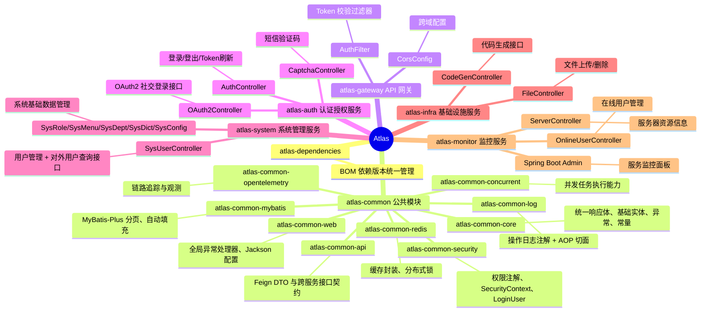
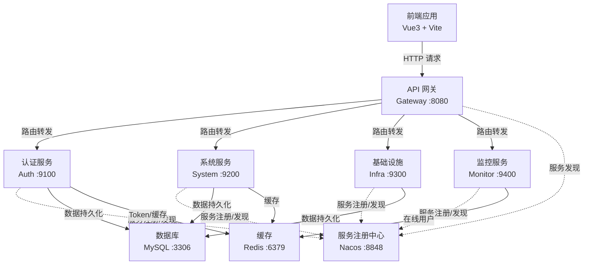

<div align="center">
  
  
  <p>企业级微服务开发平台</p>
  
  
  
  
  
  
</div>

---

## 简介

Atlas 是一个基于 Spring Boot 3 + Spring Cloud + JDK 21 构建的企业级微服务开发平台，提供完整的认证授权、权限管理、系统监控、代码生成等开箱即用的基础能力。

项目采用模块化设计，公共能力按职责拆分为独立子模块，业务服务通过 API 模块解耦，适合作为中后台管理系统的技术底座。

## 核心特性

- **JWT 认证授权** - 基于 JWT Token 的无状态认证，支持 Token 刷新和自动续期
- **多登录方式扩展** - 基于 `grantType` 路由登录处理器，支持密码、验证码、微信登录
- **细粒度权限控制** - 基于注解的权限校验（`@RequiresPermission`），支持超级管理员和角色权限
- **在线用户管理** - 实时监控在线用户，支持强制下线和会话管理
- **网关安全增强** - Token 合法性校验、跨域配置、统一鉴权过滤
- **数据安全** - 数据库密码加密存储，敏感信息保护
- **操作日志** - 基于 AOP 的操作日志自动记录（`@OperLog`）
- **验证码支持** - 提供短信验证码接口（`/auth/captcha/sms`）
- **服务监控** - 集成 Spring Boot Admin，实时监控服务状态
- **代码生成器** - 提供代码生成接口骨架，便于后续扩展
- **模块化设计** - 公共能力独立封装，业务服务按需依赖

## 技术栈

| 分类        | 技术                   | 版本           |
|-----------|----------------------|--------------|
| 核心框架      | Spring Boot          | 3.2.4        |
| 微服务       | Spring Cloud         | 2023.0.1     |
| 微服务（阿里巴巴） | Spring Cloud Alibaba | 2023.0.1.0   |
| ORM       | MyBatis-Plus         | 3.5.5        |
| 数据库       | MySQL                | 8.x          |
| 缓存        | Redis + Redisson     | 7.x / 3.27.0 |
| 注册/配置中心   | Nacos                | 2.x          |
| 网关        | Spring Cloud Gateway | -            |
| 认证        | JWT (jjwt)           | 0.12.5       |
| 连接池       | Druid                | 1.2.21       |
| 工具库       | Hutool               | 5.8.25       |
| 构建工具      | Maven                | 3.9+         |
| JDK       | OpenJDK              | 21           |

## 项目结构



## 架构概览



## 服务端口

| 服务            | 端口   | 说明          |
|---------------|------|-------------|
| atlas-gateway | 8080 | API 网关，统一入口 |
| atlas-auth    | 9100 | 认证授权服务      |
| atlas-system  | 9200 | 系统管理服务      |
| atlas-infra   | 9300 | 基础设施服务      |
| atlas-monitor | 9400 | 监控服务        |

## 快速开始

### 环境准备

- JDK 21+
- Maven 3.9+
- MySQL 8.x
- Redis 7.x
- Nacos 2.x

### 1. 克隆项目

```bash
git clone https://github.com/your-org/atlas.git
cd atlas
```

### 2. 初始化数据库

```sql
CREATE DATABASE atlas DEFAULT CHARACTER SET utf8mb4 COLLATE utf8mb4_general_ci;
```

执行 SQL 脚本（按顺序）：

```text
doc/sql/01_atlas.sql
doc/sql/02_atlas_update_openid.sql
doc/sql/03_security-enhancement.sql
doc/sql/04_add-system-config-menu.sql
doc/sql/05_sys_oper_log.sql
```

### 3. 启动基础设施

```bash
# 启动 Nacos（单机模式）
sh nacos/bin/startup.sh -m standalone

# 启动 Redis
redis-server

# 启动 MySQL
# 确保 MySQL 服务已运行
```

### 4. 构建项目

```bash
mvn clean install -DskipTests
```

### 5. 按顺序启动服务

```bash
java -jar atlas-gateway/target/atlas-gateway-1.0.0.jar
java -jar atlas-auth/target/atlas-auth-1.0.0.jar
java -jar atlas-system/target/atlas-system-1.0.0.jar
java -jar atlas-infra/target/atlas-infra-1.0.0.jar
java -jar atlas-monitor/target/atlas-monitor-1.0.0.jar
```

也可以在 IDEA 中直接运行各模块 `*Application` 启动类。

## 网关路由

所有请求通过网关 `http://localhost:8080` 统一转发：

| 路径前缀          | 转发目标          | 说明     |
|---------------|---------------|--------|
| `/auth/**`    | atlas-auth    | 认证相关接口 |
| `/system/**`  | atlas-system  | 系统管理接口 |
| `/infra/**`   | atlas-infra   | 基础设施接口 |
| `/monitor/**` | atlas-monitor | 监控相关接口 |

## 核心接口

### 认证接口

```text
POST /auth/login                  # 登录，获取 Token
POST /auth/logout                 # 登出，销毁 Token
POST /auth/refresh                # 刷新 Token
GET  /auth/captcha/sms?phone=xxx  # 获取短信验证码
GET  /auth/wecom/config           # 获取企业微信登录参数
GET  /auth/oauth2/weibo/success   # 微博 OAuth2 回调
```

### 系统管理接口

```text
GET    /system/user
GET    /system/user/{id}
POST   /system/user
PUT    /system/user
DELETE /system/user/{id}

GET    /system/role
GET    /system/menu
GET    /system/dept
GET    /system/dict/type
GET    /system/config/type/{configType}
```

### 基础设施

```text
POST   /infra/file/upload               # 文件上传
DELETE /infra/file/{fileId}             # 文件删除
GET    /infra/codegen/tables            # 数据表列表
POST   /infra/codegen/generate/{table}  # 代码生成
```

### 监控

```text
GET    /monitor/server/info    # 服务器信息（CPU、内存、磁盘使用率）
GET    /monitor/online         # 在线用户列表
DELETE /monitor/online/{token} # 强制用户下线
```

## 模块依赖关系

```text
atlas-common-core ◄─── atlas-common-web
                  ◄─── atlas-common-redis
                  ◄─── atlas-common-mybatis
                  ◄─── atlas-common-security ◄── atlas-common-redis
                  ◄─── atlas-common-log
                  ◄─── atlas-common-api
                  ◄─── atlas-common-concurrent
                  ◄─── atlas-common-opentelemetry

atlas-gateway     ◄─── atlas-common-core
                  ◄─── atlas-common-security

atlas-auth        ◄─── atlas-common-web / redis / security / mybatis / log / api / opentelemetry

atlas-system      ◄─── atlas-common-web / redis / mybatis / security / log / api / opentelemetry

atlas-infra       ◄─── atlas-common-web / redis / mybatis / security / log / opentelemetry

atlas-monitor     ◄─── atlas-common-web / redis / security / opentelemetry
```

## 配置说明

各服务的配置文件位于 `src/main/resources/application.yml`，主要配置项：

| 配置项                                        | 默认值                                 | 说明               |
|--------------------------------------------|-------------------------------------|------------------|
| `spring.cloud.nacos.discovery.server-addr` | `127.0.0.1`                         | Nacos 地址         |
| `spring.datasource.url`                    | `jdbc:mysql://127.0.0.1:3306/atlas` | 数据库连接            |
| `spring.data.redis.host`                   | `127.0.0.1`                         | Redis 地址         |
| `atlas.jwt.secret`                         | `atlas-jwt-secret-key-...`          | JWT 密钥（生产环境务必修改） |
| `atlas.jwt.expiration`                     | `7200`                              | Token 有效期（秒）     |

## 安全特性

- **网关 Token 校验** - 网关层统一校验 Token 合法性和有效期
- **权限注解** - 基于 AOP 的细粒度权限控制，支持方法级别权限校验
- **验证码防护** - 登录场景支持验证码能力，降低暴力破解风险
- **会话管理** - 支持在线用户监控和强制下线，及时处理异常会话
- **操作审计** - 通过 `@OperLog` 记录关键业务操作日志

## 开发规范

- 统一响应体：所有接口返回 `CommonResult<T>` 格式
- 服务间调用：通过 `atlas-common-api` 定义 DTO / 接口契约
- 操作日志：在 Controller 方法上添加 `@OperLog` 注解自动记录
- 权限控制：使用 `@RequiresPermission` 注解标记需要权限的接口
- 分页查询：统一使用 `PageQuery` 接收分页参数

## License

[MIT](LICENSE)
